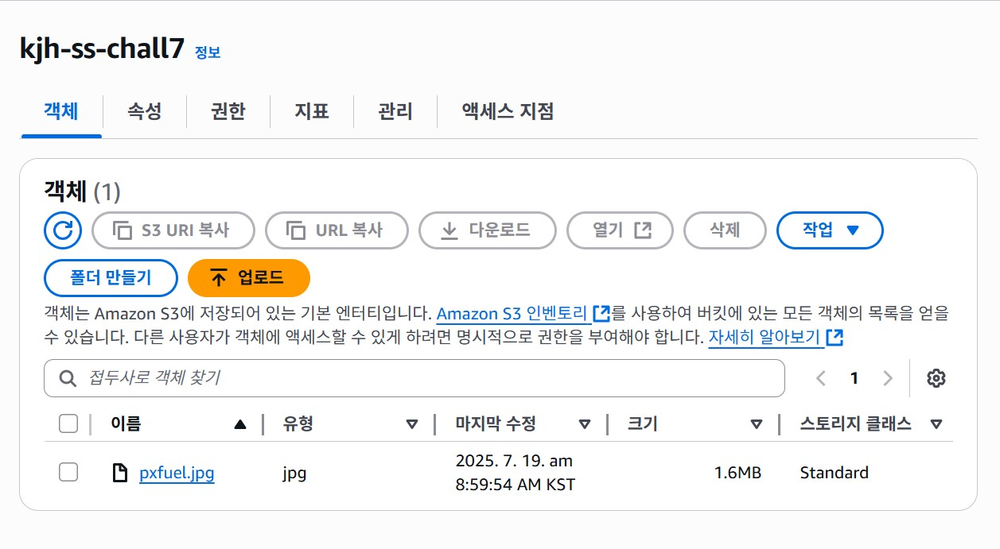

# Day 7 학습 요약: 전 세계로 빠르게, CloudFront

## ① CloudFront와 지연 시간

CloudFront는 전 세계 주요 도시에 위치한 수백 개의 **엣지 로케이션(Edge Location)**을 통해 사용자의 지연 시간(Latency)을 획기적으로 줄여줍니다. 사용자가 콘텐츠를 요청하면, 가장 가까운 엣지 로케이션이 응답합니다. 만약 해당 엣지 로케이션에 콘텐츠의 복사본, 즉 **캐시(Cache)**가 있다면, 멀리 있는 원본 서버(Origin)까지 가지 않고 즉시 콘텐츠를 전달합니다. 이 덕분에 사용자는 물리적 거리에 상관없이 빠르고 쾌적한 속도를 경험하게 됩니다.

---

## ② OAI vs OAC

OAI(Origin Access Identity)는 예전 방식이고, OAC(Origin Access Control)는 더 개선된 최신 방식입니다. OAC는 OAI에 비해 다음과 같은 점이 개선되었습니다.

-   **보안 강화:** OAC는 임시 보안 자격 증명을 사용하고 더 자주 교체하여 보안을 강화했습니다.
-   **SSE-KMS 지원:** OAC는 AWS KMS로 암호화된 S3 객체에 직접 접근할 수 있지만, OAI는 불가능했습니다.
-   **동적 요청 지원:** OAC는 `PUT`, `POST` 같은 동적인 요청을 S3에 전달하는 것을 지원하여 활용 범위가 더 넓습니다.

---

## ③ 무효화(Invalidation)의 필요성

캐시의 TTL(Time To Live, 유효 기간)을 기다리지 않고 무효화를 실행해야 하는 경우는 **긴급한 콘텐츠 수정**이 필요할 때입니다. 예를 들어, 웹사이트에 잘못된 가격 정보나 법적으로 문제가 되는 이미지를 올렸을 때, 최대한 빨리 모든 사용자에게 수정된 내용이 보이도록 즉시 캐시를 삭제해야 합니다.

반대로, 무효화를 너무 자주 사용하면 **비용 문제**가 발생합니다. AWS는 매월 일정량의 무효화 경로(예: 1,000개)는 무료로 제공하지만, 그 이상부터는 경로 하나당 과금이 됩니다. 따라서 사소한 업데이트마다 무효화를 실행하면 예상치 못한 비용이 발생할 수 있으므로, TTL 설정을 적절히 활용하고 꼭 필요한 경우에만 무효화를 사용해야 합니다.

---

## ④ 느낀 점

오늘은 S3에 저장된 정적 콘텐츠를 전 세계에 빠르게 배포하는 방법을 배웠습니다. 특히 CloudFront가 단순히 파일을 복사해두는 것을 넘어, OAC/OAI를 통해 비공개 버킷과 안전하게 통신하는 아키텍처가 인상 깊었습니다. 엣지 로케이션과 캐싱이라는 개념 덕분에 왜 해외 사이트의 이미지 로딩 속도가 빠른지 그 원리를 명확히 이해할 수 있었습니다.

실습 과정에서 URL 경로를 제대로 확인하지 않아 `Access Denied` 오류를 겪었지만, 이 문제 해결 과정을 통해 가장 기본적인 부분을 다시 한번 되돌아보는 계기가 되었습니다.

