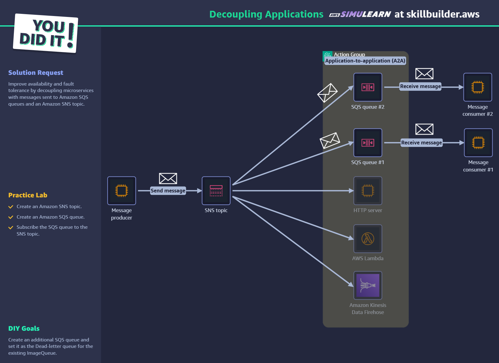

**예시 시나리오** 
운영 중인 쇼핑몰에서 블랙 프라이데이 이벤트가 시작되자 주문량이 폭주했습니다. 주문을 처리하는 백엔드 서버가 감당하지 못하고 다운되면서, 고객들은 주문 버튼을 눌러도 응답이 없거나 오류 페이지만 보게 되었습니다. 더 심각한 것은, 서버가 다운된 동안 들어온 모든 주문 데이터가 유실되었다는 점입니다. 당신의 임무는 "주문 접수(프론트엔드)와 주문 처리(백엔드)를 분리하여, 주문량이 아무리 많아져도 주문 데이터는 절대 유실되지 않고, 나중에라도 순서대로 안전하게 처리되는" 아키텍처를 구축하는 것입니다.

오늘의 목표
**SQS(Simple Queue Service)**의 개념과 큐(Queue)의 역할을 이해한다.

**SNS(Simple Notification Service)**의 개념과 주제(Topic) 및 구독(Subscription) 모델을 이해한다.

SNS와 SQS를 연동하여 팬아웃(Fan-out) 아키텍처를 구성할 수 있다.

시스템 구성 요소를 **디커플링(Decoupling)**하는 것이 왜 중요한지 설명할 수 있다.

# Day 10 학습 요약: 디커플링의 구현, SQS와 SNS

## ① SQS vs SNS

**SQS(Simple Queue Service)**와 **SNS(Simple Notification Service)**는 둘 다 메시지를 처리하지만, 작동 방식과 목적이 다릅니다.

-   **SQS (대기열):** **1:1 비동기 메시지 처리**에 사용됩니다. 메시지를 보내는 생산자(Producer)와 메시지를 처리하는 소비자(Consumer) 사이의 **'대기열'** 역할을 합니다. 소비자가 메시지를 가져가 처리할 때까지 안전하게 보관하며, 소비자는 자신이 처리할 수 있는 속도에 맞춰 메시지를 **가져옵니다(Pull)**. 주문 처리 시스템처럼 메시지가 반드시 한 번만 안정적으로 처리되어야 할 때 적합합니다.

-   **SNS (주제):** **1:N 메시지 발행/구독**에 사용됩니다. 하나의 주제(Topic)에 메시지를 **발행(Push)**하면, 해당 주제를 구독하는 모든 구독자(SQS, Lambda, 이메일 등)에게 메시지를 **동시에 전달**합니다. 긴급 공지나 이벤트 발생을 여러 시스템에 한 번에 알려야 할 때 적합합니다.

---

## ② 팬아웃(Fan-out) 패턴

오늘 실습한 것처럼 SNS 주제에 여러 SQS 대기열이나 다른 서비스를 구독시키는 **팬아웃(Fan-out) 패턴**은 **하나의 이벤트를 기반으로 여러 개의 서로 다른 작업을 동시에 트리거**해야 할 때 매우 유용합니다.

**예시:** 온라인 쇼핑몰에서 '결제 완료'라는 이벤트가 SNS 주제로 발행되면,
-   `주문 처리 SQS 대기열`은 배송 준비를 시작하고,
-   `재고 관리 Lambda 함수`는 해당 상품의 재고를 감소시키며,
-   `데이터 분석 Kinesis`는 매출 데이터를 기록하고,
-   `마케팅 이메일 구독자`는 고객에게 구매 감사 이메일을 발송합니다.

이처럼 서로 다른 역할의 시스템들이 각자의 일을 독립적으로 수행하게 하여 효율성을 극대화할 수 있습니다.

---

## ③ 디커플링(Decoupling)의 장점

아키텍처의 구성 요소들을 '느슨하게 결합(디커플링)'하는 것은 다음과 같은 이점을 가져옵니다.

-   **안정성:** 메시지 큐(SQS)가 중간에서 완충 작용을 하므로, 특정 소비자(예: 재고 처리 시스템)가 장애로 다운되더라도 생산자(주문 접수 시스템)는 계속해서 주문을 받을 수 있습니다. 장애가 다른 시스템으로 전파되는 것을 막아 전체 시스템의 안정성이 향상됩니다.
-   **확장성:** 각 구성 요소를 독립적으로 확장할 수 있습니다. 예를 들어 주문 처리가 느려지면, 주문 접수 시스템에 영향을 주지 않고 주문 처리 시스템(소비자)의 EC2 인스턴스 수만 늘려서 병목 현상을 해결할 수 있습니다.

---

## ④ 느낀 점

오늘은 SQS와 SNS를 통해 강력한 이벤트 기반 아키텍처를 구축하는 방법을 배웠다. 특히 하나의 SNS 메시지가 여러 SQS, Lambda 등으로 동시에 퍼져나가는 팬아웃 패턴은 디커플링의 힘을 시각적으로 보여주는 좋은 예시였다. 단순히 요청과 응답을 주고받는 것을 넘어, 중간에 '대기열'이라는 완충 지대를 두는 것이 왜 시스템의 안정성과 확장성에 중요한지 명확히 이해할 수 있었다.

처리 실패한 메시지를 별도로 보관하는 데드 레터 큐(DLQ)의 개념도 인상 깊었다. 단순히 실패를 무시하는 것이 아니라, 나중에 분석할 수 있도록 안전하게 격리하는 체계적인 오류 처리 방식이 실제 운영 환경에서는 반드시 필요하겠다는 생각이 들었다.

**실습 완료 화면:**
