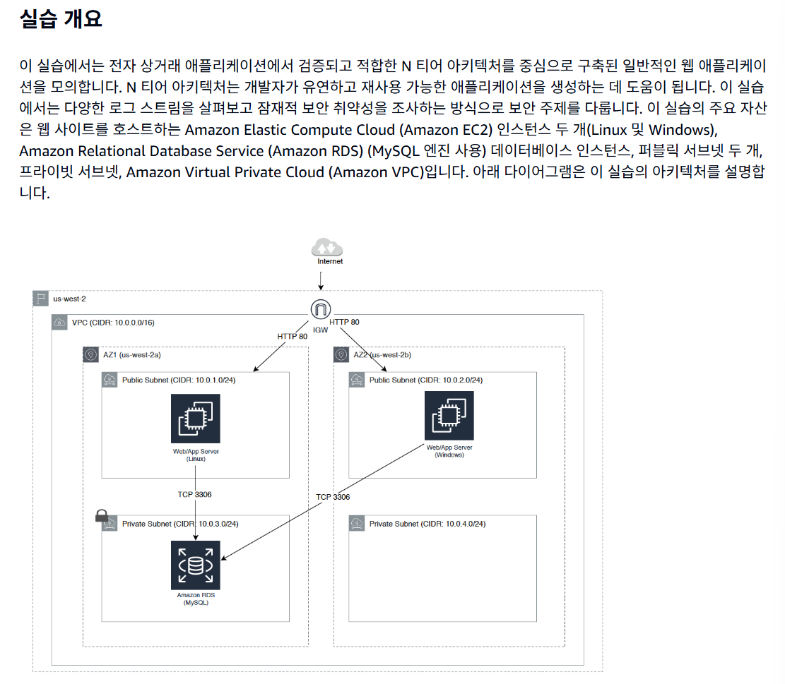

# Day 12 학습 요약: CloudWatch로 인프라 감시하기

## ① CloudWatch의 3요소: 지표, 로그, 이벤트

CloudWatch는 AWS 리소스를 모니터링하는 핵심 서비스이며, 세 가지 주요 구성 요소로 나뉩니다.

-   **지표 (Metrics):** 시간의 흐름에 따라 기록되는 **숫자 데이터**입니다. EC2의 CPU 사용률, 네트워크 사용량처럼 성능을 측정하고 추세(Trend)를 분석하는 데 사용됩니다.
-   **로그 (Logs):** 애플리케이션이나 OS가 생성하는 **텍스트 기록**입니다. 특정 이벤트의 발생, 오류 메시지 등 구체적인 사건의 내용을 담고 있어 문제 해결(Troubleshooting) 및 감사(Auditing)에 사용됩니다.
-   **이벤트 (Events):** AWS 환경에서 발생한 **상태 변화나 사건** 그 자체를 의미합니다. 'EC2 인스턴스가 시작됨', 'S3에 파일이 업로드됨'과 같은 이벤트가 발생하면, 이를 감지하여 Lambda 함수를 실행하는 등 다른 서비스와 연동하는 데 사용됩니다.

---

## ② CloudWatch 경보의 구성

CloudWatch 경보는 특정 조건이 충족되었을 때 자동으로 조치를 취하는 기능이며, 4가지 핵심 요소로 구성됩니다.

1.  **지표 (Metric):** 감시할 대상을 지정합니다. (예: `CPUUtilization`)
2.  **기간 (Period):** 지표를 얼마나 자주 확인할지 시간 간격을 설정합니다. (예: 5분)
3.  **임계값 (Threshold):** 경보를 울릴 기준값을 설정합니다. (예: 70%보다 클 때)
4.  **작업 (Action):** 경보가 울렸을 때 수행할 동작을 지정합니다. (예: SNS 주제로 이메일 보내기)

---

## ③ 기본 지표 vs 사용자 지정 지표

-   **기본 지표 (Basic Metrics):** AWS 서비스가 **자동으로 수집하여 CloudWatch에 제공**하는 기본적인 성능 지표입니다. EC2의 경우 CPU 사용률, 네트워크 I/O, 디스크 I/O 등이 여기에 해당합니다.
-   **사용자 지정 지표 (Custom Metrics):** 기본적으로 제공되지 않는, 사용자가 직접 수집하여 CloudWatch로 전송하는 지표입니다.

**EC2 인스턴스의 메모리(RAM) 사용률**은 AWS가 아닌 **사용자의 운영체제(OS)가 관리**하는 영역입니다. AWS는 하이퍼바이저 레벨에서 가상 머신의 외부 상태만 볼 수 있고, OS 내부에서 메모리가 어떻게 사용되는지는 들여다볼 수 없으므로 기본 지표로 제공하지 않습니다. 이 정보를 수집하려면 사용자가 직접 **CloudWatch 에이전트**를 EC2에 설치해야 합니다.

---

## ④ 느낀 점

오늘은 CloudWatch를 통해 인프라의 상태를 감시하고 문제 상황에 자동으로 대응하는 방법을 배웠다. 단순히 리소스를 생성하는 것을 넘어, 안정적으로 '운영'하기 위해 모니터링이 얼마나 중요한지 깨달을 수 있었다. 특히, CPU 사용률에 따라 경보를 울리고 SNS로 알림을 받는 실습은 자동화된 시스템 관리의 핵심을 보여주는 경험이었다.

실습을 통해 되돌아본 **3티어 아키텍처**는 웹 서버는 퍼블릭 서브넷에, 데이터베이스는 프라이빗 서브넷에 배치하여 보안과 기능을 계층별로 분리하는 클라우드 설계의 정석임을 다시 한번 확인할 수 있었다. 각 구성 요소가 왜 그 위치에 있어야 하는지 명확히 이해하게 되었다.

### ## Q1. 각 웹 서버에서 성공한 HTTP 호출은 몇 개입니까?

-   **로그 그룹:** `AccessLogGroup` 또는 `IISLogGroup`
-   **목표:** HTTP 상태 코드 `200`(성공)이 포함된 로그를 필터링하여 2시간 단위로 개수를 집계합니다.

```sql
fields @message
| filter @message like /200/
| stats count() by bin(2h)

## Q2. 포트 3306에 대한 호출을 수행하는 모든 IP 주소는 무엇입니까?
로그 그룹: VPCFlowLogGroup

목표: VPC 흐름 로그에서 목적지 포트(dstPort)가 3306(MySQL/RDS 기본 포트)인 트래픽을 찾아, 어떤 소스 IP(srcAddr)가 접속을 시도했는지 집계합니다. 이를 통해 허가되지 않은 접근 시도를 탐지할 수 있습니다.

fields @srcAddr, @dstPort
| stats count(*) as callsOnPort3306 by srcAddr, dstPort
| filter dstPort = 3306
| sort by callsOnPort3306 desc
| limit 20

## Q3. 액세스 로그 및 IIS 로그의 상위 20개 IP 주소는 무엇입니까?
로그 그룹: AccessLogGroup 또는 IISLogGroup

목표: 로그 메시지를 파싱하여 소스 IP(srcIp)를 추출하고, 가장 많이 접속을 시도한 상위 20개의 IP 주소를 찾습니다.

fields @message
| parse @message '* - * [*] "* * *" * *' as srcIp, identity, dateTimeString, httpVerb, url, protocol, statusCode, bytes
| stats count(*) as numHitsBySrcIp by srcIp
| sort by numHitsBySrcIp desc
| limit 20

## Q4. 마지막 IAM 사용자가 로그인한 IP 주소와 이 사용자가 수행한 작업은 무엇입니까?
로그 그룹: CloudTrailLogGroup

목표: CloudTrail 로그를 분석하여 IAM 사용자의 활동 기록을 최신순으로 정렬하여, 어떤 IP에서 어떤 작업을 수행했는지 추적합니다.

fields @timestamp, sourceIPAddress, userIdentity.userName, eventType, eventName, eventSource
| filter userIdentity.type = "IAMUser"
| sort @timestamp desc
| limit 20

## Q5. 포트 22를 통해 웹 서버에 로그인을 시도하는 사람이 있습니까?
로그 그룹: SSHLogGroup

목표: SSH 접속 로그를 분석하여 비정상적인 로그인 시도(잘못된 자격 증명 등)가 있었는지 확인합니다.

잘못된 사용자 자격 증명으로 시도한 경우
parse @message '* * * * * * * * * * * *' as Mon, day, timestamp, destip, id, msg1, msg2, msg3, msg4, srcIp, msg6, destPort
| filter msg2 = 'user'
| sort by @timestamp desc

Amazon skill builder 강의 
Collecting and Analyzing Logs with Amazon CloudWatch Logs Insights

**실습 아키텍처 다이어그램:**
