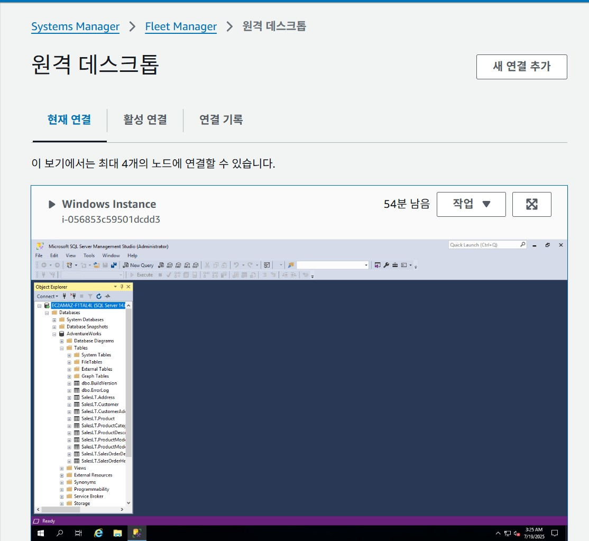

# Day 8 학습 요약: 관리형 데이터베이스의 시작, RDS

## ① EC2 vs RDS

데이터베이스를 EC2에 직접 설치하지 않고 RDS를 사용하는 것의 가장 큰 장점은 **관리형 서비스**라는 점입니다.

1.  **관리 부담 감소:** AWS가 OS 패치, 데이터베이스 소프트웨어 업데이트, 백업, 장애 조치 등 복잡하고 반복적인 운영 작업을 자동으로 처리해 주므로, 개발자는 애플리케이션 개발에만 집중할 수 있습니다.
2.  **고가용성 및 내구성:** 클릭 몇 번으로 다중 AZ(Multi-AZ) 배포를 구성하여 데이터베이스 장애 발생 시 자동으로 다른 AZ의 예비 DB로 전환할 수 있어 서비스 중단을 최소화합니다.
3.  **손쉬운 확장성:** 스토리지 용량을 동적으로 늘리거나, 읽기 전용 복제본(Read Replica)을 쉽게 추가하여 읽기 트래픽을 분산시키는 등 성능 확장이 매우 용이합니다.

---

## ② Multi-AZ vs Read Replica

다중 AZ(Multi-AZ) 배포와 읽기 전용 복제본(Read Replica)은 둘 다 원본 DB를 복제하지만, 목적이 완전히 다릅니다.

-   **다중 AZ (Multi-AZ):** **고가용성 및 장애 복구**가 목적입니다. 다른 가용 영역(AZ)에 원본 DB와 동일한 예비(Standby) DB를 동기식으로 복제해 둡니다. 평소에는 사용하지 않다가 원본 DB에 장애가 발생하면, AWS가 자동으로 예비 DB로 전환(Failover)하여 서비스를 재개합니다.
-   **읽기 전용 복제본 (Read Replica):** **읽기 성능(Read performance) 향상 및 부하 분산**이 목적입니다. 원본 DB의 복사본을 비동기식으로 생성하여, `SELECT`와 같은 읽기 요청을 이 복제본으로 보냄으로써 원본 DB의 부하를 줄여줍니다. 장애 복구용으로는 사용할 수 없습니다.

---

## ③ 왜 프라이빗 서브넷인가?

데이터베이스는 애플리케이션의 가장 중요하고 민감한 데이터를 저장하는 핵심 구성 요소이므로, **최소한의 접근만 허용**하는 것이 보안의 기본 원칙입니다.

데이터베이스를 인터넷과 직접 통신이 불가능한 **프라이빗 서브넷**에 배치하면, 외부 인터넷에서의 직접적인 공격(예: 무차별 대입 공격, SQL 인젝션) 시도를 원천적으로 차단할 수 있습니다. 오직 VPC 내부의 허가된 리소스(예: 웹 서버 보안 그룹)만이 데이터베이스에 접근할 수 있도록 보안 계층을 추가하여 데이터 유출 및 침해 위험을 크게 줄여줍니다.

---

## ④ 느낀 점

오늘은 RDS를 이용해 안전한 데이터베이스 환경을 구축하는 방법을 배웠다. 특히 데이터베이스는 반드시 프라이빗 서브넷에 배치하고, 보안 그룹으로 소스를 제어해야 한다는 원칙이 왜 중요한지 체감할 수 있었다.

실습 중 SSMS(SQL Server Management Studio)의 Object Explorer에서는 `AdventureWorks` 데이터베이스가 정상적으로 보였지만(첫 번째 이미지), 막상 'SQL Server Import and Export Wizard'를 실행하니 '보이는 테이블이나 뷰가 없다'는 메시지가 나타나 당황스러웠다(두 번째 이미지). 이 과정을 통해 단순히 DB에 연결되는 것과, 특정 도구가 데이터를 읽어오는 것은 다른 차원의 문제일 수 있다는 점을 배웠다.

**SSMS 연결 성공 화면:**

**Import/Export Wizard 오류 화면:**
