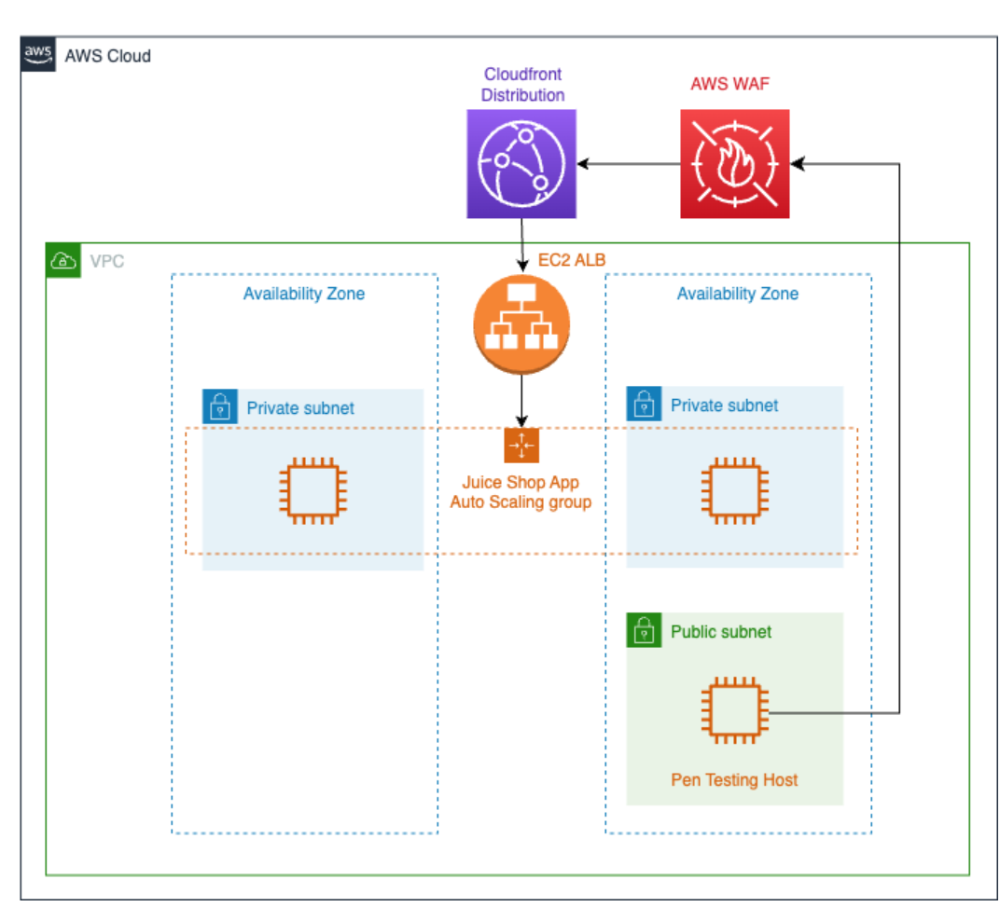

# Day 16 학습 요약: AWS의 보안 방패, WAF, Shield, KMS

## ① 보안 그룹/NACL vs WAF

보안 그룹/NACL과 AWS WAF는 둘 다 방화벽 역할을 하지만, 방어하는 공격의 종류가 다릅니다 (OSI 7계층 기준).

-   **보안 그룹 / 네트워크 ACL:** **네트워크 계층(L3) 및 전송 계층(L4)**에서 작동합니다. `IP 주소`와 `포트 번호`를 기반으로 트래픽을 허용하거나 차단합니다. "1.2.3.4 IP에서 오는 80번 포트 요청은 허용"과 같은 규칙을 설정하며, 서버로 들어오는 문지기 역할을 합니다.

-   **AWS WAF (Web Application Firewall):** **애플리케이션 계층(L7)**에서 작동합니다. HTTP/HTTPS 요청의 **내용(콘텐츠)**을 검사하여 악의적인 공격인지 판단합니다. `SQL 인젝션`이나 `크로스 사이트 스크립팅(XSS)`처럼, 허용된 IP와 포트로 들어오더라도 그 내용이 악성 코드일 경우 이를 탐지하고 차단합니다. 애플리케이션에 전달되는 편지의 내용을 검사하는 보안 요원과 같습니다.

---

## ② Shield Standard vs Advanced

-   **Shield Standard (표준):** 모든 AWS 고객에게 **추가 비용 없이 자동으로 활성화**됩니다. 네트워크 및 전송 계층(L3/L4)에서 가장 흔하게 발생하는 일반적인 DDoS(분산 서비스 거부) 공격으로부터 AWS 서비스를 보호합니다.

-   **Shield Advanced (고급):** 정교하고 규모가 큰 DDoS 공격(L3/L4/L7)에 대한 **고급 보호 기능**을 제공하는 유료 서비스입니다. 가장 큰 차이점은 **24시간 연중무휴 DDoS 대응팀(DRT)의 지원**을 받을 수 있고, 공격으로 인해 급증한 AWS 사용 요금을 보전해주는 **'비용 보호'** 기능이 제공된다는 점입니다.

---

## 실습 아키텍처

이번 챌린지 실습에서 구축하고 방어한 웹 애플리케이션의 전체 아키텍처입니다.

---

## ③ KMS 키의 종류

KMS에는 세 가지 유형의 키가 있으며, 제어 수준과 관리 주체에서 차이가 있습니다.

-   **AWS 소유 키 (AWS Owned Key):** AWS 서비스가 내부적으로 사용하는 키입니다. 사용자는 이 키를 보거나 관리할 수 전혀 없습니다.
-   **AWS 관리형 키 (AWS Managed Key):** 사용자를 대신하여 AWS가 생성하고 관리하는 키입니다. S3, EBS 등의 서비스에서 암호화를 활성화할 때 기본으로 생성되며, 사용이 간편하지만 키 정책을 직접 수정할 수는 없습니다.
-   **고객 관리형 키 (Customer Managed Key):** **사용자가 직접 생성하고, 키 정책, 교체 주기 등 모든 것을 완벽하게 제어**할 수 있는 키입니다. 가장 높은 수준의 제어와 유연성을 제공하며, 여러 서비스에 걸쳐 동일한 키를 사용하거나, 키에 대한 접근 권한을 세밀하게 감사해야 하는 규제 준수 요구사항이 있을 때 사용됩니다.

---

## ④ 느낀 점

오늘은 **Fleet Manager**를 통해 EC2 인스턴스에 접속하여 WAF 챌린지 랩을 수행했다. 먼저 공격자의 입장에서 **OWASP ZAP** 프록시를 설정하고, 이를 통해 웹 애플리케이션에 **SQL 인젝션**과 **XSS(크로스 사이트 스크립팅) 공격**을 직접 실행하며 취약점을 찾는 흥미로운 경험을 했다.

그 후 방어자의 입장이 되어 AWS 관리형 규칙(Core rule set)을 적용했지만, 일부 공격이 여전히 통과하는 것을 확인했다. 이를 해결하기 위해 특정 패턴을 차단하는 **'Add own rule'(사용자 지정 규칙)**을 추가하고 나서야 모든 공격을 완벽하게 막을 수 있었다.

이 과정을 통해 관리형 규칙이 대부분의 일반적인 위협을 막아주는 강력한 1차 방어선이지만, 실제 운영 환경에서는 애플리케이션의 특성을 이해하고 직접 규칙을 추가하는 커스텀 보안 설정이 반드시 필요하다는 것을 깨달았다.