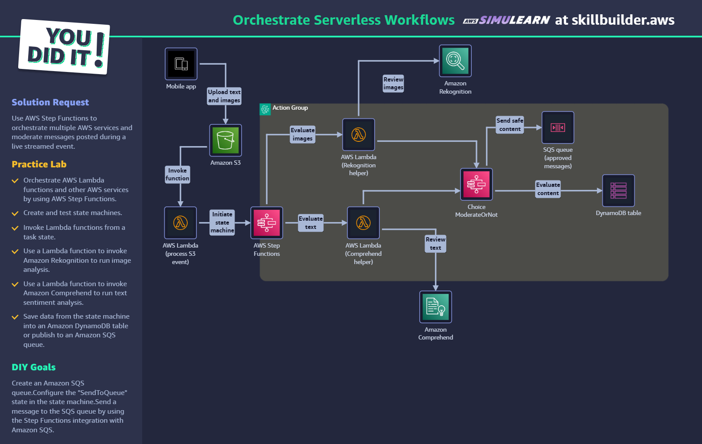

# Day 22 학습 요약: 서버리스 워크플로 오케스트레이션

---

### ① AWS Step Functions의 역할: 워크플로의 지휘자

**AWS Step Functions**는 여러 서버리스 서비스들을 하나의 정해진 순서와 규칙에 따라 동작하도록 조율하는 **'총괄 프로듀서(Executive Producer)'** 역할을 한다. S3 이벤트 발생부터 시작하여 Lambda 함수 호출, AI 서비스 분석, 조건부 판단, 결과 저장까지 이어지는 복잡한 과정을 하나의 워크플로로 묶어 중앙에서 관리하고 시각적으로 모니터링할 수 있게 해준다.

---

### ② 상태 머신(State Machine)을 통한 흐름 제어

Step Functions의 워크플로는 **'상태 머신'**이라는 설계도를 통해 정의된다. 이번 실습에서는 다음과 같은 주요 상태들을 활용했다.

-   **Parallel (병렬) 상태**: 이미지 분석(Rekognition)과 텍스트 분석(Comprehend)을 **동시에 진행**하여 전체 처리 시간을 단축시키는 효율적인 상태다.
-   **Task (작업) 상태**: Lambda 함수를 호출하거나, SQS에 메시지를 보내는 등 실제 '일'을 수행하는 상태다. 특히 이번 실습의 DIY 목표였던 **`sqs:sendMessage`** 통합을 통해, Lambda를 거치지 않고도 상태 머신이 직접 다른 AWS 서비스와 상호작용할 수 있음을 확인했다.
-   **Choice (선택) 상태**: Rekognition과 Comprehend의 분석 결과를 바탕으로, "콘텐츠가 안전한가?"를 판단하는 `if-else`문과 같은 분기점이다. 이 상태 덕분에 심사 통과/실패에 따른 후속 조치를 자동화할 수 있다.

---

### ③ 서버리스 서비스들의 유기적인 협력

이번 실습은 각 서버리스 서비스가 어떻게 협력하여 하나의 솔루션을 만드는지 명확하게 보여주었다.

-   **Trigger (계기)**: **Amazon S3**에 사용자가 이미지와 텍스트를 업로드하며 모든 과정이 시작된다.
-   **Orchestrator (지휘자)**: **Step Functions**가 전체 워크플로를 총괄한다.
-   **Workers (작업자)**: **AWS Lambda** 함수들이 Rekognition, Comprehend 같은 AI 서비스를 호출하는 중간 다리 역할을 수행한다.
-   **Analysts (분석가)**: **Amazon Rekognition**은 이미지의 유해성을, **Amazon Comprehend**는 텍스트의 감성을 분석한다.
-   **Decoupling (분리)**: **SQS** 큐는 심사를 통과한 메시지를 담아두는 '임시 보관소' 역할을 하여, 후속 처리 시스템과의 의존성을 낮춰준다.
-   **Storage (저장소)**: **DynamoDB**는 워크플로의 최종 결과를 저장하여 언제든 조회할 수 있게 한다.

---

### ④ 느낀 점

Lambda나 SQS를 따로 공부할 때는 각자 독립적으로만 보였는데, Step Functions를 통해 이들을 하나의 거대한 '자동화 공장'처럼 엮을 수 있다는 점이 신기했다. 특히 상태 머신에서 직접 SQS로 메시지를 보내는 통합 작업을 해보면서, 모든 것을 Lambda 함수로 연결할 필요 없이 서비스 간의 역할을 명확히 분리할 수 있다는 점이 인상 깊었다. 단순히 서버가 없는 것을 넘어, 복잡한 비즈니스 로직을 시각적으로 설계하고 자동으로 실행 및 관리할 수 있다는 점에서 서버리스 오케스트레이션의 강력함을 느낄 수 있었다.