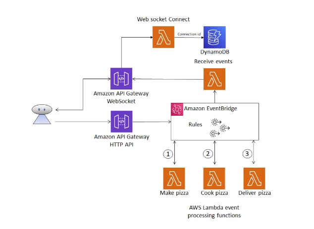

① EventBridge의 역할: 이벤트 기반 워크플로의 코디네이터
Amazon EventBridge는 여러 AWS 서비스나 애플리케이션에서 발생하는 이벤트를 감지하고, 이를 미리 정의된 **규칙(Rules)**에 따라 필요한 대상(Target)으로 라우팅하는 '지능형 이벤트 버스(Intelligent Event Bus)' 역할을 수행합니다. 이번 실습에서는 HTTP API 요청을 이벤트로 변환하여 EventBridge에 전달하고, 이 이벤트가 정해진 순서에 따라 여러 Lambda 함수를 연쇄적으로 호출하는 워크플로를 구축했습니다.

② API Gateway를 통한 다중 채널 인터페이스
클라이언트 애플리케이션과의 접점은 두 가지 유형의 API Gateway로 구성되어, 각기 다른 역할을 수행합니다.

HTTP API: 클라이언트가 POST 요청을 보내면, 이 요청의 본문이 EventBridge 이벤트로 변환되어 전달됩니다. 이는 복잡한 비즈니스 로직을 API 게이트웨이에서 분리하고, EventBridge를 통한 유연한 아키텍처를 가능하게 합니다.

WebSocket API: 클라이언트와 서버 간의 실시간 양방향 통신을 담당합니다. 클라이언트가 연결되면 DynamoDB에 Connection ID를 저장하고, 이후 이벤트가 발생할 때마다 해당 클라이언트에게 상태 업데이트를 전송하는 통로 역할을 합니다.

③ 서버리스 서비스들의 유기적인 협업
이번 실습은 각 서버리스 서비스가 이벤트라는 단일 매개체를 통해 어떻게 유기적으로 협업하는지 명확하게 보여줍니다.

진입점(Entry Point): Amazon API Gateway가 클라이언트 요청을 받아 이벤트를 생성합니다.

지휘자(Orchestrator): Amazon EventBridge가 이벤트를 수신하고, 이벤트 패턴에 따라 Make pizza, Cook pizza, Deliver pizza와 같은 Lambda 함수들을 순차적으로 호출하여 워크플로를 진행합니다.

작업자(Workers): AWS Lambda 함수들이 각 단계의 비즈니스 로직을 처리합니다.

상태 저장소(State Store): DynamoDB는 WebSocket의 연결 정보(connection_id)를 저장하여, EventBridge에 의해 트리거된 Lambda 함수가 특정 클라이언트에게 메시지를 보낼 수 있도록 합니다.

④ 느낀 점
HTTP 요청을 직접 Lambda 함수로 보내지 않고, EventBridge라는 중간 매개체를 사용하는 방식은 시스템의 확장성과 유연성을 크게 향상시킨다는 점이 인상 깊었습니다. 각 서비스가 서로 직접적으로 의존하지 않고, 오직 이벤트를 주고받는 방식으로 소통함으로써 개별 서비스의 변경이 전체 시스템에 미치는 영향을 최소화할 수 있습니다. WebSocket을 통해 서버의 비동기적인 작업 진행 상황을 클라이언트에게 실시간으로 전달하는 경험은 사용자 경험 측면에서도 매우 중요한 가치를 지닌다는 것을 깨달았습니다.